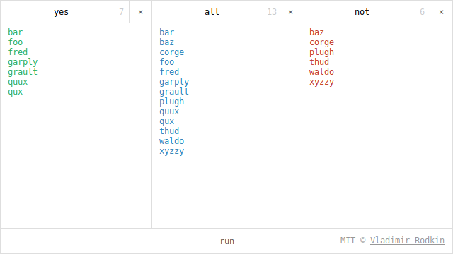

# yes-all-not

> Filter not selected list items

Demo: [vovanr.github.io/yes-all-not][demo]

## License
MIT © [Vladimir Rodkin](https://github.com/VovanR)

[demo]: http://vovanr.github.io/yes-all-not
